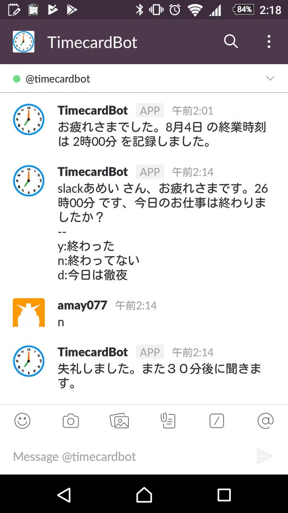

タイムカードボット (TimecardBot)
---

毎月ですね、弊社では月末になるとその月の日報提出させられるんですよ、EXCELで。
その時、日毎の終業時刻を記入するのが面倒なんですね。
中には OS のシステムログからシャットダウンした時刻を抽出して終業時刻にするひとも居ますね。
それも面倒なので。

弊社では、ほぼ Skype を常時起動させているので、Skype のボットが仕事が終わったかを聞いてくれるようにしました。

* 終業時刻になると「仕事終わった？」と聞いてきます。
  * それに「はい」と答えるとその日の終業時刻が記録されます。
  * 「いいえ」と答えると、３０分後にまた聞いてきます。
  * 「うぜぇ、今日は徹夜なんだよ」という人は「d」と答えるとその日はもう聞いてきません。
  * 仕事が休みだったら「今日は休み」と答えてあげてください。
* Botが聞き始める時刻、聞くのを諦める時刻はユーザー毎に設定できます。

これは Microsoft の Bot Framework と Azure Functions を使用して作成されています。
* ３０分おきに「聞く」のは Azure Functions の Timer Trigger でやってます
* その他、Bot の基本的な機能は Bot Application でできています
* 情報の保存は Azure Table Storage を使っています

Bot Framework のおかげで、次のチャットサービス?に対応しています
* Skype
* Slack

[他にも対応できる](https://docs.microsoft.com/en-us/bot-framework/portal-configure-channels) ようだけど、まあニーズがあれば。
いろいろやりたいことは [issues](https://github.com/amay077/TimecardBot/issues) に書いていくので、なにかあればどなたでも追加やコメントください。

Visual Studio 2017 preview 2 と Bot Framework Template や Bot Framework Emulator があれば、このリポジトリを clone して手元で動作させられると思います（preview 2 が必要なのは Azure Functions の方なので、Bot だけなら普通の VS2017 でいけます）。

Skype と Slack の BOT は準備ができたら一般向けに公開するつもりなので、もうしばらくお待ち下さい。
